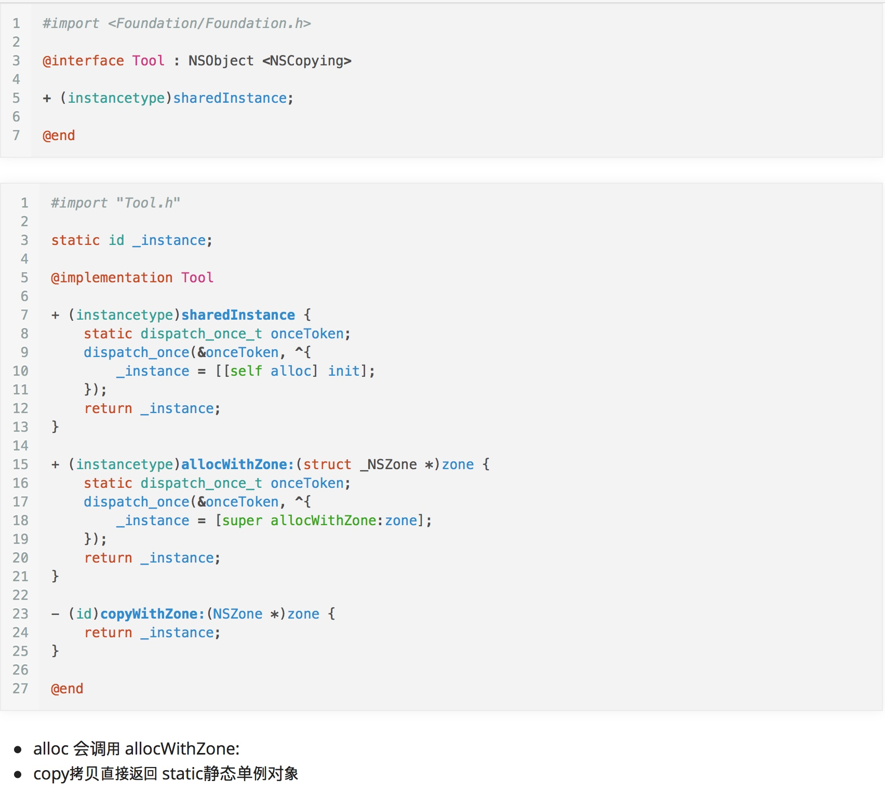

# Runtime
### 以下内容来源均为：http://xiongzenghuidegithub.github.io 的笔记
1. 实例变量的内存布局在程序`[编译期间]`就已经确定了，新增或减少一个实例变量，就必须要`[重新编译]`程序代码，让编译器重新计算所有实例变量的内存布局
2. Cat对象->_firstName的实际作用
	1. 首先找到Cat对象所在的内存的起始地址
	2. 从某个全局记录表中，查询到`[实例变量_firstName]`对应的地址偏移量offset
	3. 通过`[偏移量offset+Cat对象的内存其实地址]`作为存取实例变量_firstName的所在内存地址
3. 为什么不能动态给现有的类添加属性
	1. 因为编译的时候已经确定实例变量的内存布局了
	2. 当我们新增属性的时候，就会导致访问错误，可能访问到其他属性
	3. 对于已生成，并注册的类我们使用`[class_addIvar]`的时候，直接会返回NO，添加失败
4. 只有在`[objc_allocateClassPair]`,`[objc_registerClassPair]`之间使用`[class_addIvar]`才可以正确添加属性
5. 使用`[@property]`的时候，编译器自动做如下事情：
	1. 属性对应的实例变量_name
	2. 实例变量的读取方法`[name]`实现
	3. 实例变量的修改方法`[setName:]`实现
	4. 使用`[self.name=@"haha"]`的时候，自动就发送KVO通知
	5. 使用`[_name＝@"haha"]`,不会出发KVO，因为KVO其实是将对象指向子类，并重写setter方法，来实现的
6. 使用@dynamic 可以告诉编译器不自动生成getter/setter,以及实例变量
7. @property修饰符
	1. nonatomic/atomic
		1. 系统默认是atomic，由编译器来完成原子性加锁操作，来同步属性变量的多线程访问，会降低性能。
		2. nonatomic,需要手动执行多线程的同步，不会由系统编译器提供原子性操作，是非线程安全的，单性能高，常见的多线程同步方法
			1. 锁：NSLock，NSRecursiveLock，NSConditionLock
			2. 信号：dispatch_semaphore_t
			3. GCD队列
	2. readwrite/readonly  属性的读写权限
	3. weak/strong/retain/copy/assion/unsafe_unretained
		1. weak:不会也不能持有指向的对象，即不会让指向的对象的retainCount＋＋
		2. strong/retain:二者是一样的对象所有权，即持有指向的对象，会让指向的对象的retainCount＋＋
			1. 持有传入的新对象,新对象retainCount++
			2. 释放已有的老对象，老对象retainCount--
		3. assign:一般用于基础数据类型变量(int,float,bool)
			1. 类似weak，但区别是，在指向的对象被废弃的时候，指针变量值不会自动赋值为nil
			2. 而weak的指针变量会自动赋值nil
		4. unsafe_unretaind:类似于assign，但是一般用于OC对象
			1. 同样和assign在指向的对象被废弃掉时，指针变量不会自动赋值为nil
		5. copy：将传入的对象进行copy([对象 copy]),然后使用strong／retain强引用的方式来持有拷贝出来的新对象
			1. 新对象 ＝ [老对象 copy]; //和strong/retain不同的地方
			2. 持有传入的新对象,新对象retainCount++
			3. 释放已有的老对象,老对象retainCount--
8. 当我们同时重写getter和setter时，系统就不会自动给我们生成成员变量了。［只重写其中一个是没关系的］
	1. 同时重写的话，需要我们自己写：@synthesize name = _name
	2. 也可以使用```@implementation Father {NSString *_name;}```
9. 属性，如何对外只读，对内读写？
	1. .h文件这样声明(只读):`[@property (nonatomic, readonly, assign) BOOL isEnable;]`
	2. .m文件需要在此声明(读写)：`[@property (nonatomic, readwrite, assign) BOOL isEnable;]`
	3. 如果有子类继承父类，也要内部读写如何办？
		1. 用上面同样的方式，在子类的.m文件中，声明父类的匿名分类，然后将只读属性设置为读写。
10. 对象的读写`[_variable]`,`[self.variable]`
	1. _variable:
		1. 绕过了属性定义的`[内存管理]`修饰
		2. 绕过了属性定义的`[读写权限]`修饰
		3. 不会触发KVO通知
	2. self.variable
		1. 可以懒加载的属性
		2. 会出发KVO
		3. 设置新值的时候，会根据属性定义的`[内存管理]`对应的修饰规则
		4. 可以重写setter，getter方法，来完成断点调试
11. 何时使用`[_variable]`,`[self.variable]`
	1. 使用_variable 来读取实例变量，避免每次进入消息发送进入class结构体中查询SEL对应的IMP
	2. 使用self.variable 来些数据，可以遵循内存管理修饰＋KVO
	3. 在init＋dealoc中，总是应该使用_variable来读写
		1. 因为子类可能重写属性的setter于getter方法的实现［我们使用_variable可确保我们的值赋予的是正确的］
		2. 如果重写setter了，在调用setter的时候，会导致父类方法中的某一实例变量未能初始化，导致程序崩溃
		3. 有懒加载的，要一直使用self.属性名来读取
12. 如何判断两个对象的等同性
	1. 我们不能通过`[A对象 == B对象]`，因为这样直接比较的是对象的地址，而不是对象内部实例的值内容
	2. 等同性，我们需要重写`[isEqual]`方法来实现,方法内部，我们可以随意对比属性的值，来返回YES，NO
13. hash
	1. 之前有地方看过，重写hash，也可以达到isEqual＝YES的效果，其实并不能，还是最终根据isEqual方法来判断的.**但是有一点我们需要明白：hash值一样，则对象内容必然等同(与iSEqueal无关)：因为不管是string，int，他们都有固定的hash值，而我们的对象其实就是这些内容构造出来的**
	2. 但是系统中有不少地方是根据Hash来判断是否相等的，像NSSet里面不会存储重复的对象，这里面NSSet判断的其实就是Hash值，如果hash一样，则会只保存一个值
	3. hash属性的实现方式(一般是下面方式...)：
	
	```
	- (NSUInteger)hash {
    NSInteger ageHash = _age;
    NSUInteger nameHash = [_name hash];
    NSUInteger pidHash = [_pid hash];
  //如果有自定义类对象属性，需要再实现那个类对象的hash值方法
  	  return ageHash ^ nameHash ^ pidHash;
	}
	```
14. 等同性判断的执行深度
	1. 如果是数组
		1. 判断两数组的长度是否一致
		2. 对每个位置的对象进行判断
15. 容器内可变对象的等同性判断

	```
	-(void)test {

    NSMutableSet *set = [NSMutableSet new];

    NSMutableArray *array1 = [@[@"1", @"2"] mutableCopy];
    [set addObject:array1];
    NSLog(@"set = %@", set); //输出(1,2)

    NSMutableArray *array2 = [@[@"1", @"2"] mutableCopy];
    [set addObject:array2];
    NSLog(@"set = %@", set); //由于array2 的 hash[应该是里面的每个值的hash加起来，而相同的string，int默认的hash值是一样的] 与 array1 的hash一样，所以还是输出（1，2）

    NSMutableArray *array3 = [@[@"1"] mutableCopy];
    [set addObject:array3];
    NSLog(@"set = %@", set);//输出((1,2),(1)),因为array3 与array1，array2的hash不一样

    //【出现错误】此时如果修改Set容器中的可变对象，array3与array1此时等同了
    [array3 addObject:@"2"];
    NSLog(@"set = %@", set); //由于array3是可变的，而且array3已经加到了set中。所以，此时输出的就是((1,2),(1,2))

    //拷贝此时的Set对象
    NSSet *copySet = [set copy];
    NSLog(@"copySet = %@", copySet);//由于执行了copy操作，会将原set中的对象copy到新的对象中，此时会再次判断hash值。最后输出(1,2)
}
	```
16. 类簇相关
	1. 像NSArray，NSDictionary，NSMutableArray，NSMutableDictionary这些其实都是类簇（类簇，其实就相当于一个工厂方法）
	2. 在这些类在alloc，init，添加对象的时候，会分别获得不同的类型
	
	```
	NSLog(@"%@",[NSArray class]);  //NSArray
    NSLog(@"%@",[[NSArray alloc] class]); //_NSPlaceholderArray
    NSLog(@"%@",[[[NSArray alloc] init] class]); //__NSArray0
    NSLog(@"%@",[[[NSArray alloc] initWithObjects:@"1", nil] class]); //__NSArrayI
	```
	
	3. 所以我们不能使用如下这样的判断,

	```
	 NSArray *arr = @[@"1", @"2"];
	 BOOL ret = [arr class] == [NSArray class];  //输出NO  ，一个是__NSArrayI 一个是  NSArray
	```
	
	4. 那么如何判断Array，NSDictionary是否是同一个类？
		1. `[[arr isKindOfClass:[NSArray class]]]`  //判断正确，因为所有的NSArray下面相应的内部类，都是NSArray类簇类的子类
		2. `[isKindOfClass]`:判断是否是这个类，或其子类的实例
		3. `[isMemberOfClass]`：判断是否是这个类的实例

17. 我们不能给已经在运行时中注册的类新增属性，但是，可以使用关联对象来代替
	1. `[void objc_setAssociatedObject(id object, const void *key, id value, objc_AssociationPolicy policy)]`
	2. `[id objc_getAssociatedObject(id object, const void *key)]`
	3. `[void objc_removeAssociatedObjects(id object)]`

		| 关联对象指定的内存策略 | 等效的@property修饰符 |
| :-: | :-: |
| `OBJC_ASSOCIATION_ASSIGN` | @property (atomic, assign) |
| `OBJC_ASSOCIATION_RETAIN_NONATOMIC` | @property (nonatomic , retain) |
| `OBJC_ASSOCIATION_COPY_NONATOMIC` | @property (nonatomic , copy) |
| `OBJC_ASSOCIATION_RETAIN` | @property (atomic , retain) |
| `OBJC_ASSOCIATION_COPY` | @property (atomic , copy) |

18. UIView不接受触摸事件的4种情况`[view.userInteractionEnable = NO]`,`[view.hidden = YES]`,`[view.alpha = 0.0~0.01]`,`[父view，或自己的frame是CGRectZero]`
19. `[UIView hitTest:WithEvent:]`源码的模拟实现

```
- (UIView *)hitTest:(CGPoint)point withEvent:(UIEvent *)event
{
    // 1. 判断自己是否能够接收触摸事件
    if (self.userInteractionEnabled == NO || self.hidden == YES || self.alpha <= 0.01) return nil;

    // 2. 判断触摸点在不在自己范围内
    if (![self pointInside:point withEvent:event]) return nil;

    // 3. 从上到下遍历自己的所有子控件，看是否有子控件更适合响应此事件
    int count = self.subviews.count;

    for (int i = count - 1; i >= 0; i--) {//依次从最顶层开始取subview
        UIView *childView = self.subviews[i];

        // 将产生事件的坐标，转换成当前相对subview自己坐标原点的坐标
        CGPoint childPoint = [self convertPoint:point toView:childView];

        // 再让subview又去他的subviews中查找适合处理事件的view
        UIView *fitView = [childView hitTest:childPoint withEvent:event];

        // 如果childView的subviews存在能够处理事件的，就返回当前遍历的childView对象作为事件处理对象
        if (fitView) {
            return fitView;
        }
    }

    //4. 没有找到比自己更合适的view
    return self;
}
```

20. 系统会先调用`[hitTest]`方法，然后才调用`[touchBegin]`。 因为需要先确认是哪个View接受事件，然后才能相应识别touchBegin
21. 事件传递过程
	1. 首先从super view开始，然后传递给所有的subviews尝试响应
	2. 一个View调用hitTest开始尝试事件响应，而掉用pointInside看是否能够处理这个坐标的事件
	3. 如果可以处理，就判断是否还有subViews
		1. 如果没有，则自己作为事件响应者返回
		2. 如果有，继续交给subviews去尝试响应
	4. 如果不能处理，则交给同级的其他view尝试响应
	5. 最终如果没有找到事件响应者，那么会将root view 作为最终的事件响应者
		1. 从`[最底层]`的RootView一直到`[最顶层]`的View发送hitTest:withEvent:消息，依次询问是否能成功响应者
		2. 但是对于某个View的所有subviews的hitTest:withEvent:消息询问，却是从`[最上面]`的到`[最下面]`的subview依次询问
	6. 响应者链条：只有`[pointInside:withEvent:]`返回`[YES]`的view,才属于响应者链条
22. UI事件响应
	1. `[事件响应者]`:继承UIResponder的对象称之为响应者对象，能处理touchBegin等触摸事件
	2. `[响应者链]`：由很多`[事件响应者]`链接在一起组合起来的一个链条称之为响应者链。但是其中有一个View是第一之间响应者，其他的都是备用。
		1. 事件传递是从父View到子View来一一询问，当找到了最小的可接受事件的响应者后。响应链却是：从子view到父View依次去响应
		2. `[找到第一响应者的View——super view——rootView——控制器View——控制器——window]`
23. 重写`[pintInside:withEvent:]`返回NO，则表示不参与事件传递，即：直接不让自己成为响应者
24. 将UIView的点击事件传递给其他View，可以直接重写`[hitTest:withEvent:]`
25. `[objc_msgSend(target,@selector(test))]`做的事情
	1. 将组装好的消息发送给target(对象或类)
	2. 然后找到接收到到消息的target对应的objc_class结构体实例，从中查询消息SEL对应的objc_method实例
		1. 对象方法，查询`[类本身]`的objc_class结构体实例
		2. 类方法，查询`[Meta]`元类的objc_class结构体实例
	3. 查询objc_method实例的过程
		1. 从`[method_cache]`种查询SEL是否存在对应的objc_method实例
			1. 如果有，直接使用找到`[obj_method]`实例，进入流程(4)
			2. 如果没有，进入流程2
		2. 获取找到的`[objc_class]`结构体实例的`[method_list]`方法列表
		3. 然后遍历找到的`[method_list]`中的所有`[objc_method]`实例，对比SEL值是否与消息中的SEL值一致
			1. 如果一致，表示找到了消息SEL对应个的函数实现objc_method实例，然后使用消息SEL作为key，找到的objc_method实例作为value缓存起来
			2. 如果都没有找到，进入父类的objc_class体实例中查找，流程走到2
		4. 找到了消息SEL对应的objc_method实例了
			1. 通过objc_method实例->IMP找到存放最终要调用的函数实现的寻访地址
			2. 继而载入找到的函数地址，那么就执行了函数调用
26. 还有三个和objc_msgSend()类似的函数
	1. `[objc_msgSend_stret(id self, SEL op, ...)]`:如果方法有结构体返回值，则用这个来发送
	2. `[void objc_msgSend_fpret(id self, SEL op, ...)]`:如果方法返回float，则用这个来发送
	3. `[objc_msgSendSuper(struct objc_super *super, SEL op, ...)]`：使用当前类的父类来发送
27. 每个OC函数，最终都会变已成为一个C函数，并使用一个objc_method的实例在运行时保存在内存中。
	1. 如果是实例方法，则保存在当前类对应的`[objc_class实例]`
	2. 如果是类方法，则保存在当前类对应的`[Meta元类]`对应的objc_class实例
28. 一个`[OC函数]`最终其实是通过`[type encoding(一串有规律的字符串，类型编码)]`与最终`[编译生成的C函数]`对应起来
29. 我们经常写一个Objective-C函数，它的结构是这样分配的(通过这样对数据类型编码，也正是为了给一个OC函数进行编码做的铺垫。那么给一个OC函数做编码的好处是，能够快速找到对应的c函数实现，而不必进行全局的遍历查找。):

30. 消息转发

	1. `[CoreData]`中的`[NSManagedObject]`的属性，全部都是@dynamc，不由编译器生成getter＋setter，而是在运行时使用消息转发机制将自己实现的函数添加到objc_class实例中
31. 实际上当消息转发流程走完后，还有一步，如果系统没有找到响应的方法，则会走当前对象的`[doesNotRecognizeSelector:]`函数，`[doesNotRecognizeSelector:]`函数默认实现中做了两件事
	1. 结束消息转发过程
	2. 抛出NSInvalidArgumentException异常
		1. 我们可以利用这个特性，例如：提醒子类必须要重写父类的某一些函数，否则让程序崩溃退出执行，提醒开发者要实现完整:
		
		```
		- (void)abstractMethod {
    //方法一、使用NSObject基类提供的停止消息转发并崩溃
    [self doesNotRecognizeSelector:_cmd];
	   //方法二、直接抛出一个异常
		//    @throw [NSException exceptionWithName:@"not implement method" reason:@"必须要重写这个函数" userInfo:nil];
		}

		```
32. 如何拦截OC函数实现的方法
	1. 创建一个目标类的子类，然后重写要拦截的函数
	2. 使用`[class_addMethod()]`,`[class_replaceMethod()]`,`[method_exchangeImplementains()]`交换两个objc_method实现的SEL指向
33. `[Person *person = [Person new];]` *代表指针，OC的对象，都放在堆上
34. `[id person = [Person new]];`  因为id本身就是个指针类型，所有person的类型就是指针变量，不需要再使用*了
35. 类在运行时中的载体

```
//一个OC类对象 最终运行时的内存载体
sturct objc_object{
	Class isa OBJC_ISA_AVAILABILITY;   //指向了objc_class(也就是Objective-C对象所属的类)
}

struct objc_class {
    Class isa  OBJC_ISA_AVAILABILITY;
#if !__OBJC2__
    Class super_class                                        OBJC2_UNAVAILABLE;
    const char *name                                         OBJC2_UNAVAILABLE;
    long version                                             OBJC2_UNAVAILABLE;
    long info                                                OBJC2_UNAVAILABLE;
    long instance_size                                       OBJC2_UNAVAILABLE;
    struct objc_ivar_list *ivars                             OBJC2_UNAVAILABLE;
    struct objc_method_list **methodLists                    OBJC2_UNAVAILABLE;
    struct objc_cache *cache                                 OBJC2_UNAVAILABLE;
    struct objc_protocol_list *protocols                     OBJC2_UNAVAILABLE;
#endif
} OBJC2_UNAVAILABLE;

```

36. OC的代码，在编译期间会将OC代码自动转换为C的代码，并在程序运行期间，创建出对应的C结构体实例，即：objc_class
37. 实例－>isa->obj_class->isa->meta Class->isa->NSObject
38. 我们写的一个Objective－C实际上包含了两部分`[类本身]`,`[元类]` 
39. 如何判断两个对象的类型[]是否一致？＝> `[[person class] == [Person class]]` **类簇不能这么比，只能用isKindOf**
	1. 因为`[person class]` 指向了 objc_object->objc_class ,`[person class]`也是指向了objc_object->objc_class 并且，objc_class 是个单例。
40. 当一个类具有很多类型的init初始化方法时，需要提供一个全能的最大init函数入口，来确保所有的默认的实例变量都能被初始化
41. `[description]`,重写这个方法，我们就可以在lldb调试的时候，使用po来输出相应信息
42. `[debugDescription]`:其实和description差不多，只不过是只有在lldb debug调试时候才有用。
43. 错误处理
	1. 使用NSError
	2. 使用枚举，定义好可能的错误业务Code
	3. 使用try catch finally
44. 对象Copy
	1. 实现NSCopying协议方法`[copyWithZone]`
45. delegate与block
	1. delegate方便调试，但是需要走消息查询，没有block直接指向函数实现速度快
	2. block会造成不易调试，产生retain cycle等。
46. ARC
 
```
//1\. 强引用类型，会让其retainCount + 1
id __strong obj = [NSObject new];

//2\. 弱引用类型，不会让其retainCount + 1，不能够持有一个对象
id __weak obj = [NSObject new];//创建之后立马就被废弃了

//3\. 自动释放池管理对象
id __autoreleasing obj = [NSObject new];//就类型[对象 autorelase];的效果

//4\. 类似 __weak，但是不同的是当对象废弃时，修饰的指针变量不会自动赋值为nil，而 __weak会
id __unsafe_unretained obj = [NSObject new];//创建之后立马就被废弃了
```

47. ARC下常见的几种产生内存泄漏的情况
	1. delegate指针变量必须使用weak来修饰，否则会造成循环引用
	2. Block循环引用
		1. 可在Block执行的最后一行，进行block=nil 操作来释放block
		2. block里面引用的对象使用week
	3. Block的循环引用，必然是两方互相持有，只有一方持有，不会形成
48. Block分为：全局，栈，堆，三种。在ARC中，默认会对Block进行copy操作，生成堆block
49. dealloc 方法能做的事情
	1. 释放strong强引用类型指针(OC对象，CoreFoundataion实例，C结构体实例)
	2. 移除关注的公知
	3. 移除KVO实例变量值改变的观察
50. 不能在dealloc方法内完成的事情
	1. 调用一步子线程任务，并等待回调时又继续操作其他对象［等掉回调时，很可能这个对象已经废弃掉了。可能会造成崩溃］
	2. 不要在dealloc方法执行的所在线程上，去执行需要在其他线程（主线程）执行的操作
	3. 不要在dealloc中调用属性的setter/getter（因为很可能当前对象监听了实例变量的KVO通知，而操作setter就会发出KVO通知，而此时观察的回调对象已经被废弃，所以也会造成程序崩溃）
51. OC中不建议使用Try{},更建议使用ErrorCode+Bool+NSError的形式
52. 善用@try-@catch-@finally捕获引发异常的代码段，并在`@catch{} or @finally{} 代码块中，对异常代码段中创建的内存对象进行释放。**系统不会自动释放try中的内容，需要我们自己在finally中释放**
53. 在不需要持有一个对象的情况下，尽量使用weak引用。注意不要使用assign、unsafe_unretained来修饰Objective-C类对象的指向，会形成野指针导致程序崩溃。
	1. strong
		1. 会retain一次传入的新值，表示一个拥有对象的关系
	2. weak
		1. 不会retain传入的新值
		2. 仅仅只是指向传入的对象，想使用对象的方法而已，并不会持有一个对象
		3. 如果使用id __weak obj = [NSObject new];执行完时对象立马会被废弃，因为无法持有对象
		4. 当所指对象被释放时，weak指向的指针会由ARC赋值nil，不会造成程序崩溃
	3. unsafe_unretained
		1. 基本上类似 weak
		2. 但是当所指对象释放时，不会由ARC将指针赋值nil
	4. assign
		1. 绝大多数情况下，不应该使用这种修饰指针指向对象
		2. 同 unsafe_unretained 一样，在所指对象废弃时，不会由ARC将指针赋值nil
	5. copy
		1. 首先对传入的对象进行拷贝，一般都是浅拷贝，生成一个新的对象
		2. 然后使用__strong修饰符修饰指针来管理该新对象
		3. 并对象之前的老对象进行释放release
		4. 其实很类似__strong，只不过会拷贝出一个新的对象，这就有点问题了 
	6. autoreleasing 
		1. 将对象放入到一个pool对象去持有
		2. 当pool对象废弃掉时，将pool内所有的对象发送release消息
		3. 通常是为了延迟对一些对象进行释放release消息
54. 使用autoreleasepool降低内存峰值
55. 多线程
	1. `[block]`其实就是一个`[NSBlock]`类簇类的对象，同样具备内存管理
	2. GCD
		1. 两种Queue线程队列
			1. Concurrent Queue 无序并发线程队列
			2. Serial Queue 顺序多线程同步队列
		2. 两种Block入队方式
			1. async 异步执行
			2. sync 立即等待执行
	3. NSBlock也是NSObject的子类，它是个类簇类，采用工厂模式，生成最终的对象（堆Block，栈block，全局block）
		
		```
	 static force_inline Class YYNSBlockClass() {
    static Class cls;
    static dispatch_once_t onceToken;
    dispatch_once(&onceToken, ^{
      //1. 定义一个block，其实得到一个Block对象
        void (^block)(void) = ^{};
        //2. block值转换成NSObject对象，获取其所属类
        cls = ((NSObject *)block).class;
        //3. 根据其isa指针，一直查找，找到其真实类型
        while (class_getSuperclass(cls) != [NSObject class]) {
            cls = class_getSuperclass(cls);
  	      }
	    });
		    return cls;
		}
		
		//输出结果：2016-07-28 00:19:10.498 Demos[6980:83290] NSBlock
		```
56. block内部可以访问（捕获）外部的变量，但是不能对外部变量进行修改。
	1. 但如果Block捕获的是 对象类型 的指针，就会自动对指针指向的对象 发送retain消息 ，也就是会去持有指针指向的对象，让这个对象的retainCount++ 
		1. 当Block如果是GCD调度执行的Block，那么就会在最终执行完毕的时候，对Block进行释放，从而让Block对象废弃，继而让Block对象持有的对象也执行释放
		2. 但是当Block对象是属于某个类对象的 实例变量时，如果`[类对象不被废弃]` 或 `[类对象不主动去释放Block对象`]，那么就会让Block对象持有传入内部指针指向对象无法释放，从而导致Block持有的对象内存泄露
	2. 对于Block对象中传入对象指针时，能让传入对象保持retainCount平衡的关键点:
		1. 对象指针传入到Block对象持有，在Block对象执行时，Block对象会对传入指针指向的对象 `[retainCount++]`
		2. 那么必须在Block对象执行完毕或不再使用时，将Block对象废弃掉，从而让Block对象持有的对象 `[retainCount--]`
57. Block对象的内存结构


58. 对于Block对象结构中有如下几个重要的东西:
	1. (1) isa指针，指向block对象的所属类，这个同之前NSObject对象的isa指针是一样的
	2. (2) invoke函数指针，指向block块内的实现代码
  `[函数返回值类型 (*函数指针变量名)(void *, 参数1, 参数2, 参数3 ..., 参数n);]`
  第一个参数是一个 void *类型的指针，这个是第一个必须传递的参数。而这个指针变量参数指向的就是要执行的Block对象。
59. Block对 外部变量、 外部对象 分别是如何捕获的
	 1. 对于基本类型变量直接就是拷贝的`[数据]`,而不是`[地址]`
	 2. `[对于OC对象，拷贝的是地址，而不是数据]`。也就是说Block对象会对外部对象形成一个strong指向，即让外部对象retainCount++。
	 3. 使用__block
		 1. 对于基本类型变量，会copy一份内存地址，扔给block，block就可以对其操作了
60. Block执行完后，如果有持有外部对象，需要对其进行释放，或者week
61. 小结Block
	* (1) Block其实是`一个Objetive-C类的一个对象`，和一般的OC类并没有什么区别，分为三类:
		* Global Block >>> 不操作任何的外部变量
	   * Stack Block >>> 局部生成的Block，ARC会默认拷贝到`堆`上
  	   * Malloc Block >>> 在堆上生成的Block对象，需要和一般的NSObject子类对象一样进行内存管理
	* (2) `NSBlock`是上面三种具体Block类型的`类簇类`

	* (3) 通常`void (^block)() = ^() { ... }` 就是在创建一个`NSBlock`子类的一个对象，既然是创建对象就会`持有`外部传入的对象
		* 持有 >>> 让被指向的对象 retainCount++
	* (4) 对于`基本数据`类型，传入Block是传递`数据拷贝`，除非使用`__block`强制传递指针

	* (5) 对于`Objetive-C对象`类型，传入Block的是一份`指针拷贝`，即会对外部对象增加一个strong引用，让被指向的对象 retainCount++
		* 虽然是指针拷贝，但也是指针，所以即使不加`__block`，也是能够修改外部对象的数据的
	* (6) 局部创建的Block对象，会在超出范围之后自动被释放，也就会让外部对象的 `retainCount--` 恢复平衡

	* (7) 对象实例变量指向的Block对象，即使超出范围但是不会自动释放，必须要手动的`_block = nil;`进行释放，才能让外部对象的 `retainCount--` 恢复平衡

	* (8) Block对象对外部捕获到的OC对象的retainCount修改:
		* 对于OC对象被Block内部使用时，让OC对象retainCount++
 	   * 当Block对象本身被废弃时，让OC对象retainCount–
  	   * 而如果Block对象本身不被废弃，那么OC对象就一直不会retainCount–，就意味着OC对象的retainCount只增不减就会出现内存泄漏

62. 但如果一个变量、一个对象、一段代码，将有可能在`[二个及二个以上的不同线程]`上执行`[读写]`，那么此时就必须进行多线程同步处理。如果不进行处理，一般会出现数据的不统一，严重的会出现野指针导致程序崩溃。
	1. 这个过程中，最主要的原因就是: **CPU随意的切换其他的线程执行任务，导致某一个线程没有完整的执行玩一段逻辑**。
	2. **解决办法**
		1. 使用GCD串行队列
		2. 使用`[@synchronized(对象){操作对象的代码}]`
			1. 可以直接让括号里面对指定的对象操作的代码，在多线程上顺序执行
			2. 当进入@synchronized(对象){ ...时，默认会创建一个互斥锁，然后进行锁定，让其他线程在外面等待
			3. 当出}时解除锁，让其他线程进入
			4. 优点
				1. 调用简单
			5. 缺点
				1. 全局所有的同步代码块，都使用同一个互斥锁，那么所有的同步代码块都必须按照顺序一个一个执行完毕，就可能造成效率低下
				2. 当某一个@synchronized(){}块的锁无法解除时，那么其他线程都无法获得锁，也就无法进去执行同步代码块中的代码了，这就是线程死锁的一种
				3.  可以控制某一次调用的 完整性，但无法控制多次操作之间的 顺序
		3. 使用NSLock
			1. `[Lock() lock]`,`[Lock() unlock]`
		4. 使用`[dispatch sync]` 同步执行，会阻塞当前线程，然后执行block中的任务。
			1. 优点：
				1. 立刻能够得到Block执行完之后的返回值（async，是异步，不能立刻得到）
				2. 不会对Block进行拷贝
			2. 缺点
				1. Block是在当前sync操作现场执行的，如果对于一些耗时cpu的代码就不太适合
		5. `[dispatch_barrier_async]`
		

63. 
64. 构建缓存时选用NSCache而不是NSDictionary


65. initialize方法与load方法之间的区别
	1. load方法、+[NSObject load]: 最好不要使用load方法
		1. 执行该方法时，运行时系统处于脆弱的状态
		2. 应用程序启动时，首先将工程中所有类的load方法都执行完毕，才会继续做下面的事情
			1. load方法中，不应该做过多耗时的事情，会影响类的加载速度
		3. 先执行父类的load方法实现，然后执行当前类的load方法
		4. 在当前类的load方法中，调用其他类的函数实现是不安全的
			1. 因为搞不清楚到底哪个类的load方法实现会被先执行
			2. 如果顺序出现问题，就会导致某个类的一些辅助变量未被初始化导致程序崩溃
		5. load方法不遵守继承规则。也就是说，一个类写了load实现就调用，如没写load实现就不调用，即不会查找父类中load实现
		6. 当类也写了load方法，分类也写了load方法，那么有调用顺序:
			1. 先调用类中的load方法
			2. 再调用分类中的load方法
	2. initialize方法 +[NSObject initialize]: 可以完成一些全局状态的变量初始化，但是不到万不得已仍然不要使用此方法完成一些任务
		1. 在第一次使用该类的时候执行initialize，且只会执行一次。在运行时由系统调用，不能人为的手动调用。
		2. 只有这个类被使用（加载）的时刻才会去执行initialize，否则永远都不会被执行
		3. initialize方法执行时，运行期系统处于正常状态
			1. 也就是说可以随意的调用其他类的方法实现
		4. initialize方法是绝对处于线程安全的环境下执行
			1. 在当前initialize方法中，操作的其他类或对象都是处于线程阻塞下执行，不会出现多个线程同时执行initialize方法实现
			2. 一直等待initialize方法方法对这些类或对象操作完毕，才会放行其他的initialize方法实现
		5. 当前类如果没有写initialize方法，就会去父类查找执行initialize方法实现，也即是说具备继承规则 
		6. initialize方法中，最好不要调用其他类的方法，甚至当前类自己的方法
66. 看到一个实现单例的最佳写法，来源于苹果官方文档建议写法，保证copy拷贝出来的仍然是单例对象
	**可以看到，主要区别是`[allocWithZone:]`中间也用了dispatch_once,这样，保证了空间只会分配一次，所以，不管我们使用`[[Tool alloc] init]`还是`[Tool sharedInstance]`都会返回同一个对象**



67. 进而，我们可以将上面的代码写成通用的宏
 


68. NSTimer对象会retain目标对象，并且不会自动对目标对象执行release，就会造成目标对象内存泄露
	1. 我们需要在停止NSTimer的时候
	
	```
	[_timer invalidate];
	_timer = nil;
	```


