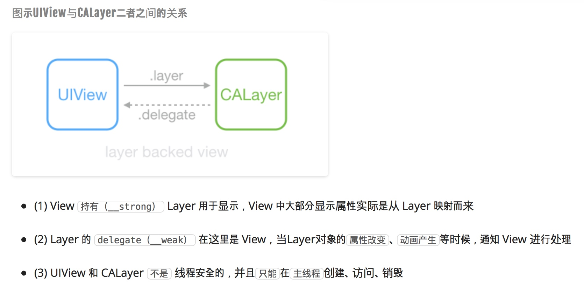

##### 保持页面的流畅
1. CoreText或者TextKit的排版，放入异步
2. 获取到数据后，即可异步去获取宽高，并保存，之后可以直接使用

##### 为什么UI对象只能在主线程上操作
1. 因为Foundnation中基本所有的UI对象都是使用nonatomic修饰，即不使用原子性进行多线程同步
2. 但是，如果加锁的话，会导致UI对象操作效率降低
3. 子线程上操作UI对象导致崩溃的原因［线程A将图片赋予Layer，然后突然线程B又插入另外一张图片。这个时候A线程的图片就会被释放掉了。但是A线程又对着被释放的图片做了其他的事情，这个时候，就会导致程序崩溃］：
	1. 设置给UI对象的图片，最终都是同步给内部的CALayer对象
	2. CALayer对象保存图片文件数据的格式是基于CoreGraphics库c语言指针形式
	3. 当线程A将图像对象设置给CALayer对象的指针，然后CALayer对象可能此时操作这个图像指针
	4. 突然有另外一个线程B进入，线程A被挂起
	5. 此时线程B进行设置CALayer对象图像指针为另外一个图像，导致CALayer对象之前的图像对象被废弃成为了野指针
	6. 此时突然cpu切换回线程A时，继续执行后续的操作这个图像指针，这是操作的野指针，所以直接导致程序崩溃
	
##### 常见 GPU 处理耗时以及解决方向
1. 纹理的渲染
	1. 我们代码中写的一些图片、文字等等显示数据，最终都是以纹理（Texture）格式的数据提交给GPU
	2. GPU 调整和渲染 Texture 的过程，都要消耗不少 GPU 资源
	3. 比如，TableView 存在非常多的图片并且快速滑动时，CPU 占用率很低，GPU 占用非常高，界面仍然会掉帧从而导致画面卡顿感
	4. 目前来说，iPhone 4S 以上机型，纹理尺寸上限都是 4096x4096，尽量不要让图片和视图的大小超过这个值
2. 试图，涂层的混合
	1. 多个视图重叠在一起，GPU会首先把它们混合到一起
	2. 随着视图的重构结构的复杂性，消耗的GPU混合时间也就增加
	3. 应当减少视图数量和层次，并在不透明的视图中标明opaque属性以及无用的Alpha通道合成
3. 图形的生成
	1. 通常是对一些UI对象处理圆角、阴影、遮罩（mask）的时候，是比较消耗GPU的
	2. 所以最好是使用预先处理好的对应效果的图像塞给UI对象去显示就好
	
##### 接下来学习Runloop的基础知识（因为ASDK深度使用Runloop来进行性能优化）
##### UIView其实包含了两个部分
1. CALayer：负责界面显示数据的绘制［我们平时对UIView做的frame，背景色，图片等，UIView会原封不动的同步设置给CALayer。然后在同步过程中转为响应的CoreGraphic格式(例如：CGColor)］
2. UIResponder：负责各种UI事件响应

##### UIView与CALayer
1. CALayer与UIView的共同点
	1. 都只能在主线程上进行操作（创建、修改、释放）
	2. UIView 与 CALayer 两者都有树状层级结构
		1. UIView: subviews
		2. CALayer: sublayers
2. CALayer做的事情：
	1. 无法响应任何UI事件
	2. 只负责最终绘制到屏幕上进行显示的数据的一个数据载体
	3. Layer比View多了个AnchorPoint
3. UIView做的事情
	1. 每个 UIView 内部都有一个 Root CALayer 在背后提供内容的绘制和显示
	2. 负责处理用户交互的各种UI事件响应
	3. **UIView充当 CALayer对象 CALayerDelegate对象，渲染动画时产生的事件**
	4. **访问和设置UIView的属性，实际上访问和设置的是UIView内部的CALayer对应的属性**

##### 离屏渲染
1. On-Screen Rendering 当前屏幕渲染、指的是GPU的渲染操作是在当前用于显示的屏幕缓冲区中进行
2. Off-Screen Rendering 离屏渲染、指的是GPU在当前屏幕缓冲区以外重新开辟一个缓冲区进行渲染［个人理解是：系统不能一次将其呈现出来，需要将集中效果在后台合并，然后才呈现出来］
3. 一般情况下，需要避免离屏渲染，因为开辟新的屏幕缓存区是需要一部分内存，而当前屏幕缓冲区 与 屏幕外缓冲区 各自的 上下文切换也很费事。会触发离屏渲染的情况（主要针对CALayer的操作）:
	1. CALayer对象设置 shouldRasterize（光栅化）
	1. CALayer对象设置 masks（遮罩）
	1. CALayer对象设置 shadows（阴影）
	1. CALayer对象设置 group opacity（不透明）
	1. 所有文字的绘制（UILabel、UITextView…），包括CoreText绘制文字、TextKit绘制文字

